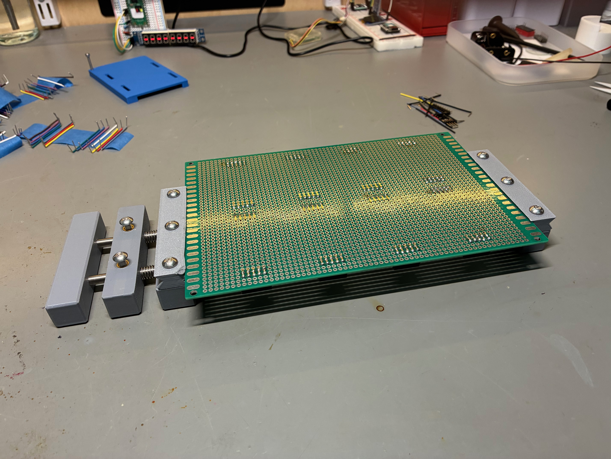
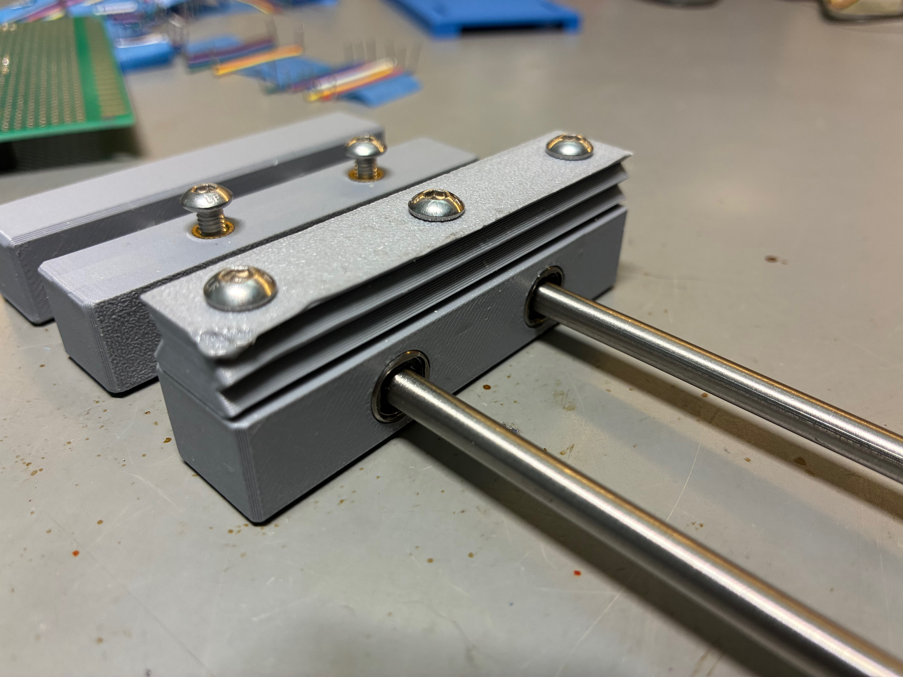
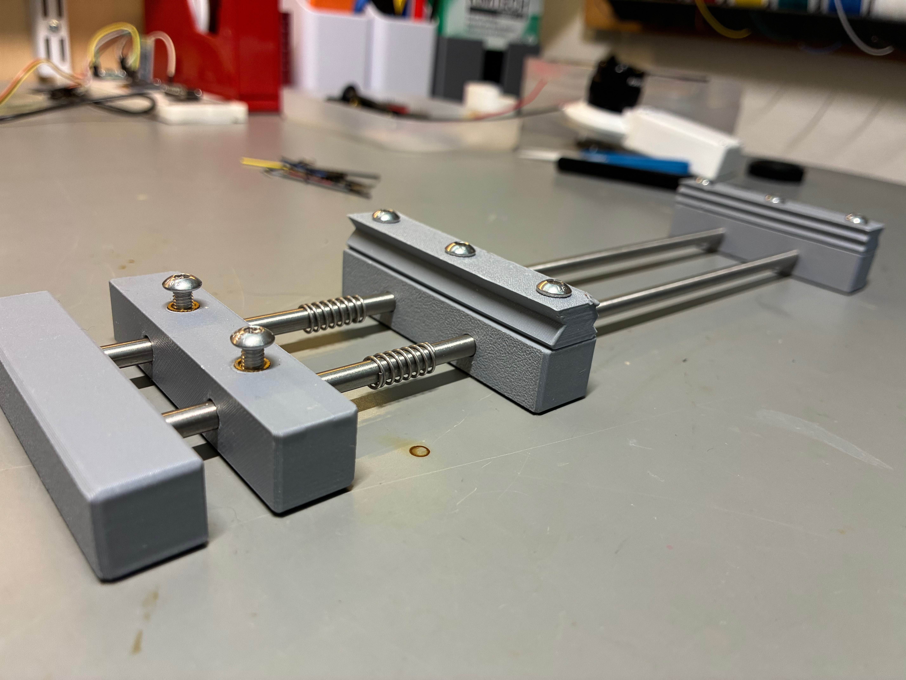

## PCB Holder

This is a simple PCB vise. Since it's plastic it's not going to work well with hot air, but for normal soldering it's great. Cleats have two tooth patterns and are consumable so when they get banged up just flip them over or print new ones.

In addition to prints (two cleats, one each of the others) I used:

- M4 insets (8)
- M4 x 10 screws (2)
- M4 x 12 screws (6)
- [5 x 250 steel rods](https://www.amazon.com/dp/B082ZNJR7D?th=1) (2)
- [5 x 10 x 15 bearings](https://www.amazon.com/dp/B0D5BDG8GW?th=1) (2)
- [Small compression springs](https://www.amazon.com/dp/B0F6HTYH42) (2)

Assemble as in the photos. Insets go into the clamp and jaw parts (not into the cleats).

